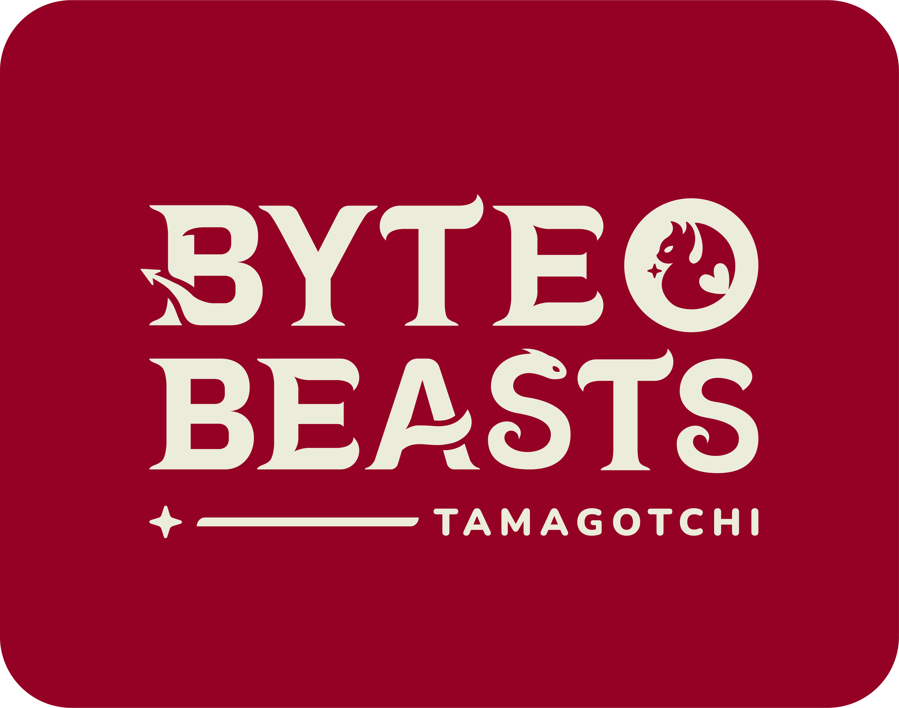

# ByteBeasts Tamagotchi

## 🌟 Overview
Welcome to ByteBeasts Tamagotchi Game! 🎮 This interactive web-based game brings to life the magical creatures of Etheria known as ByteBeast. 🐾 Players act as guardians responsible for nurturing and caring for their Beasts, building a unique bond, and ensuring their companion grows strong and healthy. 💖

## Client
- 

## Dojo
- 

## Founders
<table>
  <tr>
    <td align="center">
      
       
      <a href="https://t.me/roloxworld">Rolando</a>
       
    </td>
    <td align="center">
      
       
      <a href="https://t.me/devjimenezz22">Luis</a>
       
    </td>
    <td align="center">
      
       
      <a href="https://t.me/coxmar23">Marco</a>
       
    </td>
    <td align="center">
      
       
      <a href="https://t.me/danielcdz">Daniel</a>
       
    </td>
  </tr>
</table>
